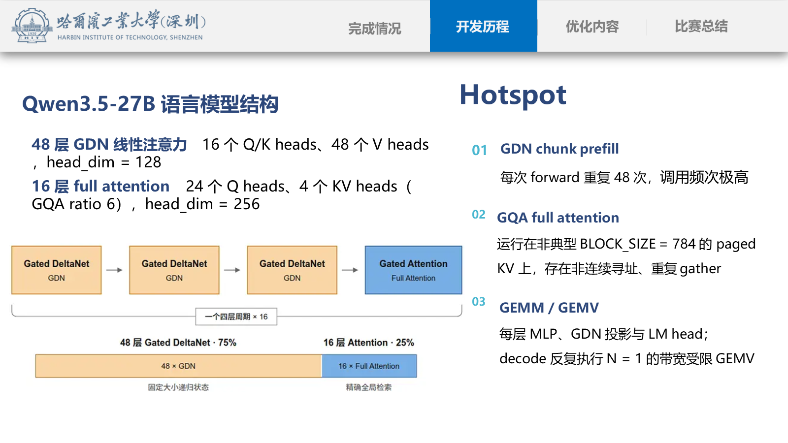
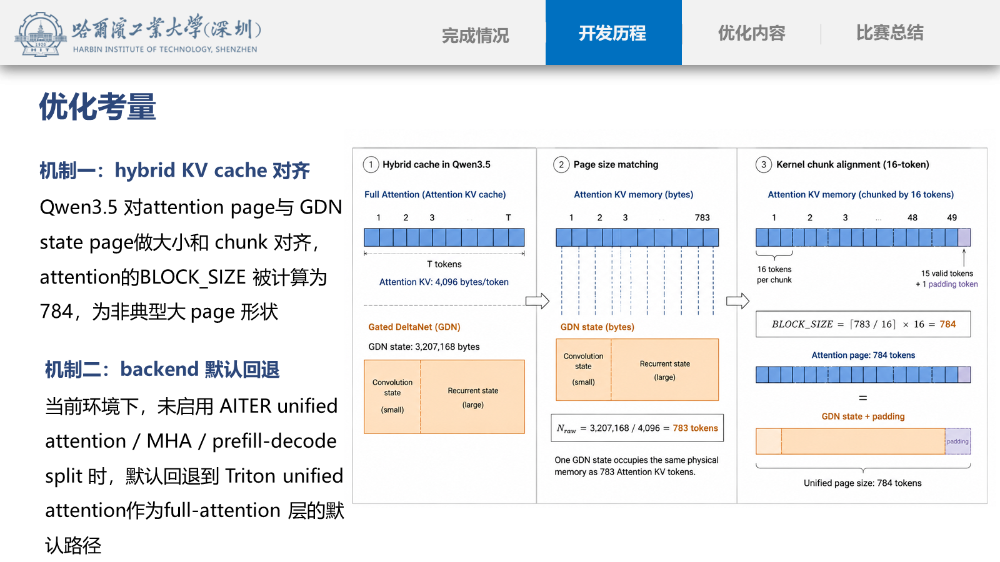
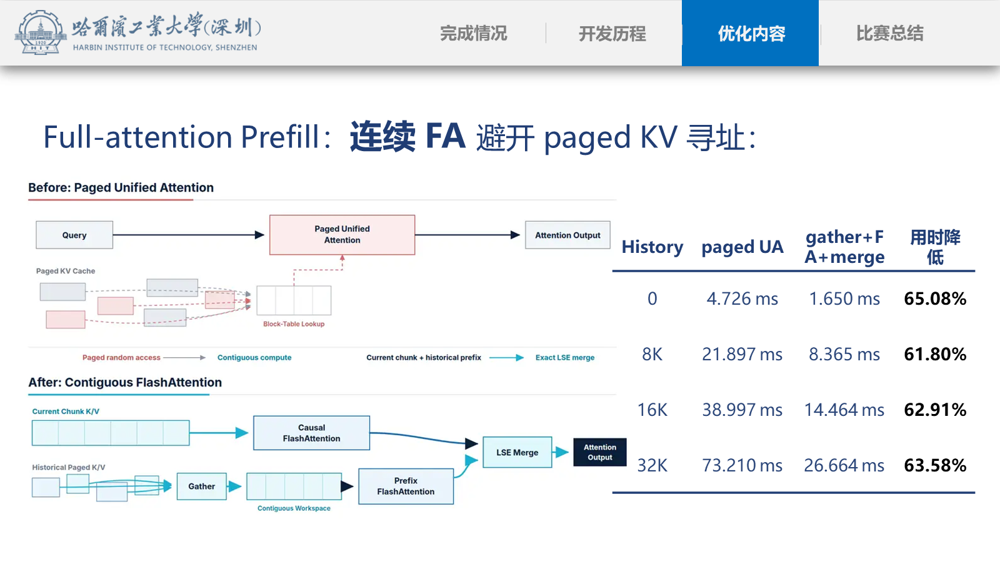
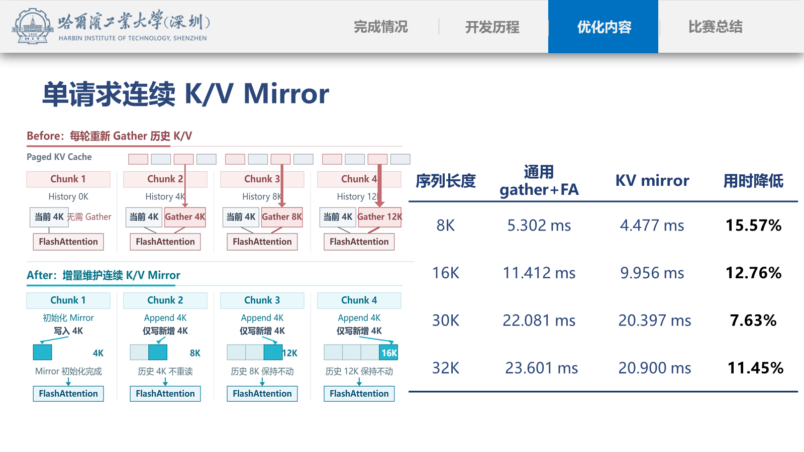
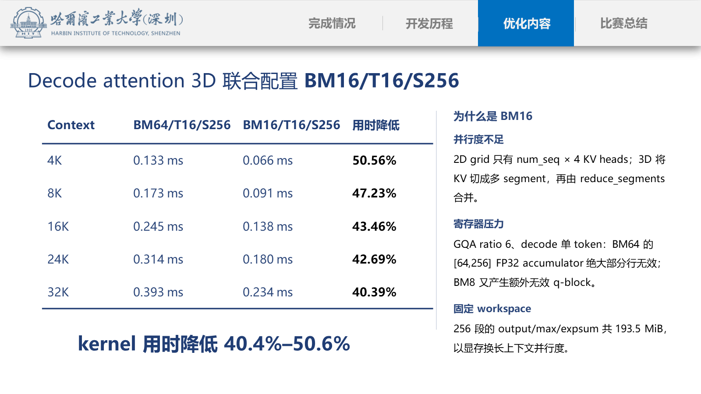
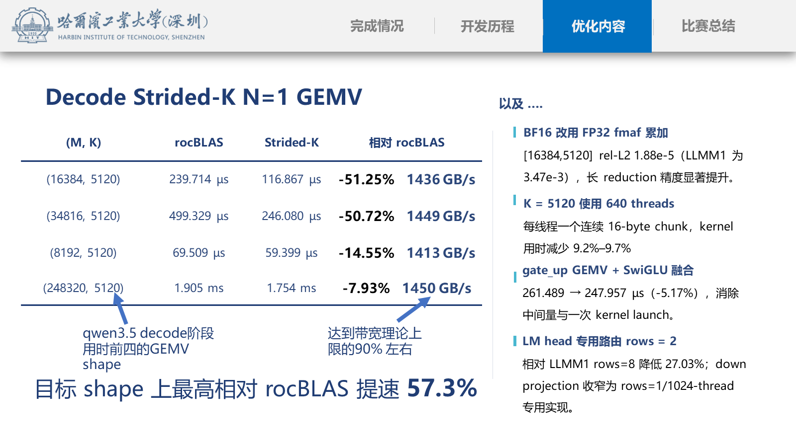
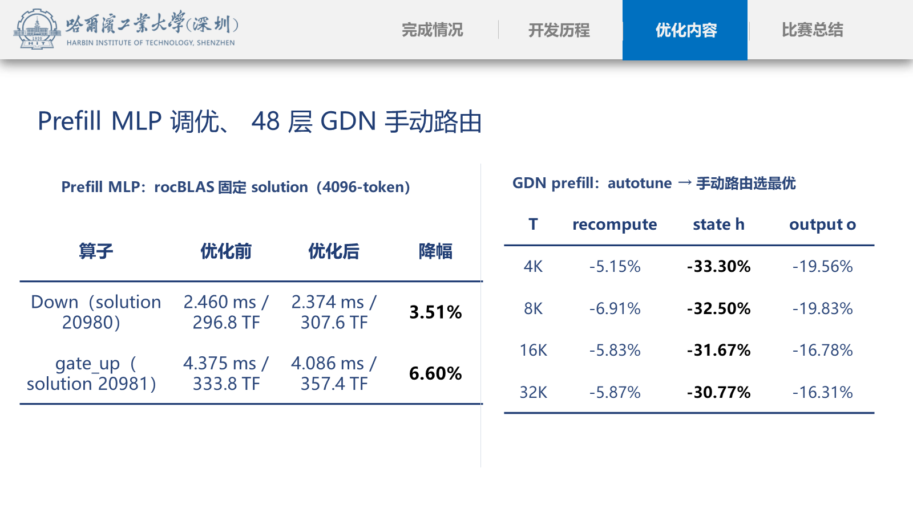

# Qwen3.5 vLLM 国产加速卡推理优化

本仓库是面向 2026 先导杯「基于国产加速卡的千问大模型推理服务优化」的
`submit/v3.0` 提交线。基础代码来自 SourceFind/OpenDAS vLLM 0.18.1，目标
环境是国产 DCU/BW1000（`gfx936`）上的 Qwen3.5-27B BF16 单卡在线推理。

这份 README 说明最终提交中各项优化的**运行原理、代码路径、触发条件、性能
证据和代价**。微基准数据来自目标机器；它们用于解释单项机制，不能把所有
百分比直接相加为端到端收益。PPT 中的图经过整理后保存在
[`docs/assets/contest-optimization`](docs/assets/contest-optimization) 中。

## 目录

- [一页结论](#一页结论)
- [模型与瓶颈](#模型与瓶颈)
- [最终运行路径](#最终运行路径)
- [Full-attention prefill](#full-attention-prefill)
- [Decode attention](#decode-attention)
- [Decode GEMV 与 MLP](#decode-gemv-与-mlp)
- [Prefill MLP](#prefill-mlp)
- [GDN prefill](#gdn-prefill)
- [统一优化方法](#统一优化方法)
- [结果与证据](#结果与证据)
- [环境、构建与回退](#环境构建与回退)
- [提交边界](#提交边界)

## 一页结论

我们的方案没有重写一套通用 vLLM，而是采用 `Tune -> Route -> Fuse/Remove`
的窄门控策略：

1. **Tune**：按真实 backend、shape、dtype 和 gfx936 资源约束调
   `BLOCK_M`、`TILE_SIZE`、warps、stages、segments 和 GEMV rows。
2. **Route**：让已经存在但没有被平台或模型 shape 选中的快速路径命中，例如
   non-paged FlashAttention、LLMM1/Strided-K 和固定 rocBLAS solution。
3. **Fuse/Remove**：融合 `gate_up GEMV + SwiGLU`，让 GDN output 直接写最终
   地址，并复用 chunk metadata，删除中间 tensor、D2D copy 和重复 launch。

最终提交覆盖六条互补路径：

| 阶段 | 主要问题 | 最终解法 |
| --- | --- | --- |
| Full-attention prefill | paged KV 的 block-table 查询和非连续 gather | 连续 FlashAttention；单请求再维护增量 KV mirror |
| Triton UA fallback | 长 query 的 q-block 和 tile 形状不合适 | 2D `BLOCK_M=64`，prefill `TILE_SIZE=16` |
| Decode attention | 只有 4 个 KV heads，2D grid 并行度不足 | 3D KV segment + LSE reduce，`BM16/T16/S256` |
| Decode GEMV | `N=1`、大 K 的带宽受限矩阵向量乘 | Strided-K、FP32 `fmaf`、640 threads 和 shape rows |
| Decode MLP | gate/up 中间量和 activation launch | 单 token `gate_up + SwiGLU` 融合 |
| GDN / prefill MLP | 48 层重复小 kernel、4096-token GEMM 未命中最佳解 | gfx936 workload bucket、output 直写、indices 复用、固定 rocBLAS solution |

这些优化分别作用于不同时间段：prefill 主要改善 TTFT，decode 主要改善
TPOT，GDN 和 MLP 则在每层 forward 中重复贡献。它们可以在最终提交中组合，
但每个候选仍按单项 A/B、正确性、SLA 和 accuracy 逐项闭环。

## 模型与瓶颈

Qwen3.5-27B 的语言模块由 64 层组成，每四层为一个周期：

```text
48 layers Gated DeltaNet (GDN) + 16 layers Gated Full Attention
```

- GDN：16 个 Q/K heads、48 个 V heads、head dimension 128；状态是 chunked
  recurrent state，prefill 会执行大量小型 Triton kernel。
- Full attention：24 个 query heads、4 个 KV heads，即 GQA ratio 6，head
  dimension 256；KV cache 为 paged layout。
- hidden size：5120；MLP intermediate size：17408；padded vocabulary：248320。
- 评测上下文档位：4-8K、8-16K、16-32K；decode 是单 token、低并发路径。



图中三个热点的含义：

1. **GDN chunk prefill** 在 48 层重复出现，小的单算子收益会被层数放大。
2. **GQA full attention** 运行在非典型 page size 784 的 paged KV 上，地址
   解析、非连续 gather 和重复读取会抵消矩阵单元的计算能力。
3. **GEMM/GEMV** 在 MLP、GDN 投影和 LM head 中反复出现；decode 的 `N=1`
   使算子更接近带宽测试而不是高算术强度 GEMM。

### 为什么 page size 是 784

Qwen3.5 的 hybrid KV cache 要同时容纳 full-attention 的 KV 和 GDN state。
attention 每 token 的 KV 存储为：

```text
4 KV heads x 256 head_dim x 2 bytes x 2 tensors (K + V)
  = 4096 bytes/token
```

目标 GDN state 的原始大小约为 `3,207,168 bytes`，对应：

```text
3,207,168 / 4,096 = 783 tokens
```

cache manager 又按 16-token chunk 对齐：

```text
ceil(783 / 16) x 16 = 784 tokens
```

因此 784 不是 attention kernel 自己选择的常规 tile，而是 hybrid cache 对齐
产生的物理 page 形状。它带来容量利用率，却让通用 paged attention 的 tile
很难同时满足 power-of-two 矩阵布局和不跨页寻址。



### BW1000/gfx936 的关键硬件约束

- wave64 下，线程数和 reduction 需要考虑 64-lane 对齐；
- full attention 的 head dimension 256 会让 Q、K/V tile、softmax 统计量和
  FP32 accumulator 同时占用 LDS/VGPR；
- GEMV 的算术强度低，性能取决于连续 16-byte HBM 读取、独立请求数和
  occupancy；
- Triton 已经可以生成平台的 MMA/MFMA 路径，盲目从零手写通用 kernel 的
  风险高于在现有路径上做精确 gate。

## 最终运行路径

把提交版看成两条时间轴会更容易理解：

```text
Prefill (num_scheduled_tokens > 1)
  -> standard full attention + FA gate
       -> continuous FA (current chunk causal + history prefix)
       -> Qwen3.5 single-request KV mirror (when state is continuous)
       -> otherwise paged gather + FA + LSE merge
       -> unsupported semantics -> Triton Unified Attention 2D

Decode (num_scheduled_tokens == 1)
  -> Triton Unified Attention 3D
       -> KV segments -> partial output/max/expsum -> reduce_segments
  -> Qwen3.5 Linear shape gate
       -> Strided-K / rows specialization / fused SwiGLU
       -> otherwise LLMM1 or torch/rocBLAS fallback

GDN prefill
  -> gfx936 shape/NT bucket -> fixed Triton configuration
  -> profile warmup before KV-cache allocation
```

路由是互斥的：不能把连续 FA 的 prefill 时间与 paged UA 的时间相加，也不能
把 decode 3D segment 的收益当作 prefill 收益。所有 gate 失败都会回退到原有
实现，避免将 Qwen3.5 的结论扩散到其他模型。

## Full-attention prefill

### 1. Triton Unified Attention 的长 query 调参

代码：[`triton_unified_attention.py`](vllm/v1/attention/ops/triton_unified_attention.py)。

2D kernel 将同一个 KV head 下的 `(query token, query head)` 展平到 M 维：

```text
BLOCK_Q = BLOCK_M // num_queries_per_kv
```

对目标 GQA6，`BLOCK_M=64` 大约覆盖 10 个 query tokens。长 query 时，较大的
M tile 可以：

- 减少 q-block program 数；
- 在更多 query rows 之间摊薄 block-table 查询和 K/V tile 循环；
- 提高一次 K/V tile 对 Q rows 的复用。

代价是 Q 和 FP32 accumulator 更大，尾部 mask 更多，VGPR/LDS 压力更高。这个
选择只针对 2D prefill/fallback；3D decode 有独立的 `BLOCK_M=16`，不会继承
BM64。需要特别说明：GQA6 不能整除 64，`64 // 6 = 10` 的最后几行仍属于
通用映射的尾部工作，因此默认目标 prefill 优先走下面的连续 FA 路径，而不是
把 BM64 当作所有 GQA6 的完美映射。

目标机纯 Triton UA 微基准（q_len=4096）：

| context | BM32 | BM64 | 用时降低 |
| ---: | ---: | ---: | ---: |
| 4K | 7.462 ms | 4.734 ms | 36.56% |
| 16K | 48.890 ms | 30.440 ms | 37.74% |
| 32K | 103.748 ms | 64.627 ms | 37.71% |

q_len=1 时 BM32 反而更快，所以 BM64 是长 prefill specialization，不是 decode
默认值。

### 2. `TILE_SIZE=16`：用 occupancy 换单次 tile 宽度

在 head dimension 256 下，一个 UA program 需要同时保留：

```text
Q tile + K/V tile + score/softmax statistics + FP32 accumulator
```

`TILE_SIZE=32` 会提高 LDS 和寄存器占用，在 gfx936 上约只能保持 1 wave/SIMD；
降到 16 后约可保持 2 waves/SIMD，能更好地隐藏 paged KV 的 HBM 延迟。纯
Triton UA kernel 的实测加速约 2.6-2.8x。该数据不等于默认 FA 路径的端到端
加速，但说明为什么 fallback 必须独立调参。

### 3. 连续 FlashAttention：先整理地址，再使用矩阵路径

代码入口：[`triton_attn.py`](vllm/v1/attention/backends/triton_attn.py)。

通用 paged UA 的主要额外工作是：每个 query block 读取 block table，计算物理
page 地址，再从碎片化 KV 中 gather。我们的 FA prefill 路径把工作拆成：

```text
current K/V -> contiguous causal FlashAttention
history KV  -> paged gather to contiguous workspace
history     -> non-causal FlashAttention
two states  -> exact LSE merge
```

当前 chunk 的 attention 是 causal 的，历史 prefix 对当前 query 已经全部可见，
所以历史 attention 可以用 non-causal FA。两部分分别得到输出 `O` 和 log-sum-exp
`LSE`，合并公式为：

```text
L = logaddexp(LSE_history, LSE_current)
O = exp(LSE_history - L) * O_history
  + exp(LSE_current - L) * O_current
```

该公式避免构造完整 score/probability 矩阵，同时保持 softmax 语义。它将 paged
访问集中到一次 gather，把主要 QK/PV 计算交给连续地址的 FlashAttention/MFMA
路径。



目标机 history 0-32K 的总延迟对比：

| history | paged UA | gather + FA + merge | 用时降低 |
| ---: | ---: | ---: | ---: |
| 0 | 4.726 ms | 1.650 ms | 65.08% |
| 4K | 13.294 ms | 5.301 ms | 60.12% |
| 8K | 21.897 ms | 8.365 ms | 61.80% |
| 16K | 38.997 ms | 14.464 ms | 62.91% |
| 24K | 56.095 ms | 20.561 ms | 63.35% |
| 32K | 73.210 ms | 26.664 ms | 63.58% |

FA gate 只在 ROCm、BF16/FP16、普通 decoder full attention、无 sliding window、
ALiBi、sinks、softcap、multimodal prefix 等扩展时启用；FlashAttention 不可
导入或语义条件不满足就回退 Triton UA。

### 4. 单请求增量 KV mirror：消除重复历史 gather

仅有 gather + FA 时，chunked prefill 每增加一个 4K chunk，都可能重新 gather
全部历史 prefix：

```text
chunk 1: gather 0K
chunk 2: gather 4K
chunk 3: gather 8K
chunk 4: gather 12K
```

在单请求、连续 chunk 的条件下，`_forward_fa_prefill_mirror` 为每个 full-
attention 层维护连续 K/V：首次写入当前 KV，后续只 append 新 token；历史
prefix 不再重复从 paged cache 读取。镜像长度与 context length 不一致、请求
超出容量或 chunk 不连续时，镜像立即失效并回退通用路径。



显存代价可以直接计算：

```text
32,768 tokens x 4 KV heads x 256 dim x 2 bytes x (K + V)
  = 128 MiB / full-attention layer
128 MiB x 16 full-attention layers ~= 2 GiB / card
```

这是明确的空间换时间：在 8K-32K 稳态 chunked-prefill 微基准中，总延迟降低
约 7.6%-15.6%，但 KV 可用容量减少，必须纳入显存和最大上下文预算。

镜像有两个 attention 组织方式：

- `seq_len <= 30,720`：一次 full-KV causal FA，避免额外 prefix/suffix merge；
- 更长但不超过 32K：当前 chunk 做 causal FA，镜像历史做 non-causal FA，
  再做一次 LSE merge；
- 超出 32K、状态不连续或不满足单请求条件：回退 gather + FA + merge。

## Decode attention

### 1. 为什么 2D grid 不够

decode 只有一个 query token。2D paged attention 的主要 grid 约为：

```text
num_sequences x num_kv_heads = num_sequences x 4
```

长上下文时，每个 program 要扫描很长的 KV，4 个 KV heads 提供的并行度不足
以填满 BW1000。于是 3D kernel 把每个 KV 序列沿 token 维切成多个 segment：

```text
producer: (query block, KV head, segment)
  -> partial output, local max, local exp-sum
reducer:
  -> merge all segment states into one output
```

分段 softmax 不是简单平均。对每个 segment 的局部状态 `(O_i, m_i, l_i)`，
先取全局 `m=max_i(m_i)`，再按 `exp(m_i-m)` 重标定 `l_i` 和 `O_i`，最后得到
全局 output。这与在线 softmax 等价，只改变了合法的归约分工。

### 2. 为什么最终是 `BM16/T16/S256`

联合扫描了 `BLOCK_M=8/16/32/64`、`TILE_SIZE=8/16/32` 和
`segments=32/64/128/256`，并把 producer 与 reducer 一起放进 HIP Graph
测量。最终配置为：

```text
TRITON_UNIFIED_ATTN_3D_BLOCK_M=16
TRITON_UNIFIED_ATTN_3D_TILE_SIZE=16
VLLM_TRITON_ATTN_NUM_PAR_SOFTMAX_SEGMENTS=256
```

选择理由：

- **BM64 的 accumulator 浪费**：GQA6 decode 只有 6 个有效 query-head 行，
  `[64, 256]` FP32 accumulator 绝大部分无效，寄存器压力直接限制 occupancy；
- **BM8 的 q-block 浪费**：`BLOCK_Q=8//6=1`，通用上界 grid 会产生额外 q-block，
  甚至启动一个随后立即返回的 program；
- **TILE16 的资源平衡**：TILE32 增加 LDS 和 softmax 工作集，没有抵消减少的
  loop 次数；
- **S256 的并行度**：4 个 KV heads 乘 256 个 segment 提供足够 producer，
  但不会像更大 segment 数那样让 reducer 和 workspace 成为主要开销。

256 段的 output/max/expsum workspace 约 193.5 MiB，是有意用显存换长上下文
并行度。该 workspace 会在 backend 初始化时建立，3D producer 和 reducer 一起
捕获，避免每 token 产生额外 launch。



目标机相对 BM64/T16/S256 的 kernel 用时：

| context | BM64 | BM16 | 用时降低 |
| ---: | ---: | ---: | ---: |
| 4K | 0.133 ms | 0.066 ms | 50.56% |
| 8K | 0.173 ms | 0.091 ms | 47.23% |
| 16K | 0.245 ms | 0.138 ms | 43.46% |
| 24K | 0.314 ms | 0.180 ms | 42.69% |
| 32K | 0.393 ms | 0.234 ms | 40.39% |

## Decode GEMV 与 MLP

### 1. Strided-K 的带宽原理

decode Linear 是 `N=1` 的矩阵向量乘：

```text
[1, K] x [K, M] -> [1, M]
```

每个输出 token 都要流过大部分权重，算术强度低，关键不是增加 FLOPs，而是让
每个 wave 发出连续、合并、足够多的 HBM 请求。

Strided-K kernel 让线程沿 K 维读取固定大小的连续 16-byte chunk，再用
grid-stride 遍历 reduction：

```text
BF16: 16 bytes = 8 elements
K=5120: 5120 / 8 = 640 chunks
640 threads = 10 wave64
```

这比通用 LLMM1 的线程数随 K 增长更适合 Qwen3.5 的固定形状，也可以处理
`K=17408` 的 down projection，而 LLMM1 的 launch thread count 会超过其
适用边界。`rows_per_block` 决定一个 block 同时负责多少输出行：大 M 需要
更多并行输出，长 K 或特殊 down projection 则收窄 rows，避免权重读取和
寄存器活跃值相互竞争。



目标 shape 的代表数据：

| `(M,K)` | rocBLAS | Strided-K | 相对 rocBLAS |
| ---: | ---: | ---: | ---: |
| `(16384,5120)` | 239.714 us | 116.867 us | -51.25% |
| `(34816,5120)` | 499.329 us | 246.080 us | -50.72% |
| `(8192,5120)` | 69.509 us | 59.399 us | -14.55% |
| `(248320,5120)` | 1.905 ms | 1.754 ms | -7.93% |
| `(5120,17408)` | 150.309 us | 151.280 us* | +0.65% |

`*` down projection 的 151.280 us 是 rows=8 参考实现；最终源码对精确
`[5120,17408]` 使用 rows=1/1024-thread specialization，而不是把 rows=8
的微基准误写成最终收益。

### 2. BF16 输入、FP32 reduction

gfx936 路径没有可直接复用的 packed BF16 dot/FMA。若模拟 `__hfma2`，每两个
乘积后就会舍入一次，并增加 unpack/pack 指令。Strided-K 将 BF16 pair 转为
FP32，逐项 `fmaf` 累加，最后按接口写回 BF16。

这同时改善性能和长 reduction 的数值稳定性：在 `[16384,5120]` 上，Strided-K
相对 rocBLAS 的 rel-L2 为 `1.88e-5`，旧 LLMM1 为 `3.47e-3`；在
`[8192,5120]` 上分别为 `3.05e-6` 和 `3.45e-3`。GEMV 的正确性因此以
FP32 reference、BF16 容差和固定 workload accuracy 共同判断，不能只看速度。

### 3. shape gate 与专用 rows

`rocm_unquantized_gemm_impl` 只在以下条件同时满足时进入 Strided-K：

- ROCm gfx9 skinny-GEMM 路径已启用；Qwen3.5 专用 rows 与 LM-head 例外还
  需要 gfx936 BF16；
- BF16/FP16、无 bias、`N=1`、连续 tensor、`K % 8 == 0`；
- M/K 命中已测 shape 或可证明的 rows 规则。

不命中时依次回退 LLMM1 或通用 `torch.nn.functional.linear`。提交中的专用
shape 包括：

| shape | 路由 | 原理 |
| --- | --- | --- |
| `K=5120` 大投影 | 640 threads | 每线程一个 16-byte chunk，10 个 wave64 |
| `[5120,17408]` down | rows=1、1024 threads | 一个 block 负责一个输出行，增加独立 HBM 请求 |
| `[248320,5120]` LM head | rows=2 | 只放开目标大词表，避免泛化到其他词表 |

### 4. 融合 gate_up GEMV 与 SwiGLU

普通路径先生成完整 `gate_up`：

```text
[1,5120] x [5120,34816] -> [1,34816]
split -> gate, up -> silu(gate) * up
```

对于 Qwen3.5 decode 的精确 shape，`LLMM_SiluMul` 在读取 gate/up 的同时完成
激活和乘法，直接产生 `[1,17408]`：

```text
weight read -> FP32/activation -> output
```

它删除了 `[1,34816]` 中间量、一次 global write/read 和一次 kernel launch。
只有 TP=1、BF16、无量化/LoRA、连续布局、`N=1` 时命中；其他情况保留原
MLP 路径。目标 shape 用时从 261.489 us 降至 247.957 us，降低 5.17%，
输出逐 bit 一致。

## Prefill MLP

4096-token prefill 的矩阵已经足够大，适合固定 rocBLAS solution，而不适合
沿用 decode GEMV：

```text
down:    [4096,17408] x [17408,5120]
gate_up: [4096,5120]   x [5120,34816]
```

代码在 gfx936、BF16、无 bias、连续 tensor 且精确 shape 时调用：

- down：rocBLAS solution `20980`；
- gate_up：rocBLAS solution `20981`。

这不是“任意 GEMM 都使用固定编号”，而是把独立 profile 验证过的 solution
绑定到唯一 shape；不满足 gate 仍使用原 GEMM。目标机结果：

| 算子 | 优化前 | 优化后 | 用时降低 |
| --- | ---: | ---: | ---: |
| down / solution 20980 | 2.460 ms | 2.374 ms | 3.51% |
| gate_up / solution 20981 | 4.375 ms | 4.086 ms | 6.60% |

两项与默认实现逐 bit 一致。风险是 solution 与 gfx936、ROCm/rocBLAS 版本和
矩阵 shape 强绑定，版本变化后必须重新 profile，不能静默沿用。



## GDN prefill

### 1. 按真实 workload bucket 路由 Triton 配置

GDN chunk pipeline 的主要阶段为：

```text
chunk_gated_delta_rule
  -> recompute_w_u
  -> chunk_gated_delta_rule_fwd_h
  -> chunk_fwd_o
```

Qwen3.5 主 shape 为 `H=48、K=128、V=128、BT=64`。源码在 gfx936 上根据
`H/K/V/BT/NT` 选择 `BK/BV/warps/stages`；`NT=ceil(T/BT)` 是 chunk 数。
例如长上下文 bucket 需要更高的并行度，而短 T 的 autotune 结果不应污染
16K-32K 正式 workload。非 gfx936 或不匹配 shape 继续走原 autotune。

48 层重复执行意味着这里不能只看一个 kernel 的绝对耗时：

| T | recompute | state h | output o |
| ---: | ---: | ---: | ---: |
| 4K | -5.15% | -33.30% | -19.56% |
| 8K | -6.91% | -32.50% | -19.83% |
| 16K | -5.83% | -31.67% | -16.78% |
| 32K | -5.87% | -30.77% | -16.31% |

### 2. output 直写、indices 复用和冷启动预热

普通 non-spec prefill 把 model runner 已经分配的 `core_attn_out` 直接传给
`chunk_fwd_o`，消除临时 output tensor 和一次 D2D copy。同一轮 pipeline 只
生成一次 chunk indices，交给 cumsum、recompute、state update 和 output
阶段复用，减少 metadata 入口调用。

V1 profile 阶段还会预热 `T=16/32/64` 的 BT 配置，并用 profile buffer 的
`NT` 代表正式长 workload，在 KV cache 分配前完成 JIT/autotune。这样首次
正式请求不再承担编译和调参的长尾，避免首请求 SLA 熔断；预热失败仍记录
warning 并让原路径处理实际请求。

### 3. GDN 的收益边界

GDN 是 recurrent/linear attention，不应套用 full-attention 的 page 或 FA
假设。这里优化的是 chunk index、state update 和 output 的数据流，以及
gfx936 上固定 workload 的 Triton 编译配置；状态更新数学和最终输出语义不变。

## 统一优化方法

### Tune：先看真实 backend，再改参数

每个参数都必须回答三个问题：

1. 实际服务命中了哪个 backend 和 kernel，而不是代码中“理论上可用”的路径？
2. 真实 shape、dtype、序列长度和并发是多少？
3. 变快来自减少 work、提高 occupancy、改善 HBM 访问，还是只是微基准缓存
   状态更热？

因此我们先建立干净 baseline，抓短服务期 profile，再做单项 microbench 和
官方脚本 A/B。PPT 中 BM64、TILE16、BM16/T16/S256、640 threads 和 GDN
bucket 都来自这种流程。

### Route：打开被 gate 掉的已有快路径

很多通用路径不是没有实现，而是被平台白名单、shape 检查或语义扩展挡住：

- gfx936 进入 `_rocm_C`/skinny GEMM 构建，才能交付自定义 Strided-K；
- 普通 full-attention prefill 走连续 FA，decode 仍走 paged Triton UA；
- 4096-token MLP 走独立 rocBLAS solution；
- GDN 在真实 `NT` bucket 走固定配置，而不是短 warmup 的通用 autotune。

### Fuse/Remove：减少内存往返和 launch

融合和删除操作的共同目标是减少不可避免的 global traffic：

- `gate_up + SwiGLU` 删除中间 gate_up tensor；
- GDN output 直写删除 D2D copy；
- chunk indices 复用删除重复 metadata 准备；
- KV mirror 删除历史 KV 的重复 gather。

### 为什么不从零手写通用 kernel

Triton 已能在 gfx936 上生成 MMA/MFMA 路径，且 vLLM 已包含大量通用优化。
从零重写通用 attention/GEMM 的代价是：需要重新处理分页、mask、softmax、
多 dtype、不同模型和回退路径，NVIDIA 的 warp 假设也不能直接迁移到 wave64。
因此提交只增加精确 shape 的窄实现，并保留原始路径作为 fallback。

## 结果与证据

### 单项 microbench

| 类别 | 代表结果 | 解释 |
| --- | --- | --- |
| UA 2D BM32 -> BM64 | 4K/16K/32K query context 用时降低 36.6%-37.7% | 纯 Triton 长 prefill fallback |
| UA prefill TILE16 | kernel 约 2.6-2.8x | 降 LDS、提高 wave residency |
| 连续 FA vs paged UA | history 0-32K 降低 60.1%-65.1% | 主要消除 paged 地址和 gather 代价 |
| KV mirror | 8K-32K 降低 7.6%-15.6% | 以约 2 GiB 镜像换重复 gather |
| 3D decode BM16/T16/S256 | kernel 降低 40.39%-50.56% | segment 并行度 + 小 accumulator |
| Strided-K | 目标 shape 相对 rocBLAS 最高降低 57.34% | 带宽型 N=1 GEMV |
| gate_up + SwiGLU | 261.489 -> 247.957 us | 删除中间量和一次 launch |
| Prefill MLP | down -3.51%，gate_up -6.60% | 固定 rocBLAS solution |
| GDN h/output | h 降 30.77%-33.30%，o 降 16.31%-19.83% | 48 层重复热点 |

### 端到端解读

单请求评测中，一个请求的近似耗时为：

```text
request_time ~= TTFT + (output_tokens - 1) x TPOT
```

因此 prefill 路径主要影响 TTFT，decode 路径主要影响 TPOT。微基准的收益
不能简单相加：

- FA prefill 与 Triton UA prefill 是互斥路由；
- KV mirror 是 FA prefill 的增量优化，不是另一条独立 attention 计算；
- BM16/T16/S256 只在 decode 生效；
- Strided-K、fused SwiGLU 和 LM head 只覆盖精确 decode shape；
- GDN 与 full attention 交错执行，收益还会受到其他层和框架调度影响。

### 正确性与稳定性门槛

候选按风险逐级晋级；进入最终栈的改动需要完成对应层级的证据：

1. same-input 数值对照和 finite 检查；
2. output length/text 或 bitwise 对照（允许明确记录的 BF16 reduction 容差）；
3. 三档官方 throughput、TTFT/TPOT SLA 和请求成功率；
4. 固定 accuracy；
5. 组合版本的 full x3 重复性和服务清理检查。

曾经出现的负收益、错误数值或无效路径会回滚，不会因为 standalone microbench
为正就写入最终提交。特别是 GEMV 的 FP32 reduction 和 attention 的 LSE merge
都必须同时看数值和性能。

## 环境、构建与回退

目标环境需要预装比赛容器指定的 DTK、PyTorch、Triton、AITER、rocBLAS 和
FlashAttention。不要用公开 PyPI 版本覆盖平台定制包。

### 默认配置

当前提交默认使用以下值；完整说明见
[`ENVIRONMENT_VARIABLES.md`](ENVIRONMENT_VARIABLES.md)：

```bash
export TRITON_UNIFIED_ATTN_BLOCK_M=64
export TRITON_UNIFIED_ATTN_3D_BLOCK_M=16
export TRITON_UNIFIED_ATTN_3D_TILE_SIZE=16
export VLLM_PREFILL_ATTN_TILE_SIZE=16
export VLLM_TRITON_ATTN_NUM_PAR_SOFTMAX_SEGMENTS=256
export VLLM_TRITON_FA_PREFILL=1
export VLLM_TRITON_FA_PREFILL_MIRROR_CAPACITY=32768
export VLLM_TRITON_FA_PREFILL_FULL_KV_THRESHOLD=30720
export VLLM_ROCM_STRIDED_GEMV=True
```

这些变量只选择已验证的默认路径；变量值改变后，必须重新做相同 shape 的
compile、correctness、A/B 和 full 评测，不能把本 README 的数据直接套用。

### 构建

源码包含 ROCm custom ops，使用完整构建流程：

```bash
bash build_vllm.sh
python -m pip install --force-reinstall --no-deps dist/vllm-*.whl
```

只做 Python 层试验时可以使用项目规定的预编译安装方式；涉及
`csrc/rocm/skinny_gemms.cu`、bindings 或 CMake 时必须完整编译。

### 回退矩阵

| 条件不满足 | 回退 |
| --- | --- |
| FA 不可导入或 attention 语义扩展存在 | Triton Unified Attention |
| KV mirror 超容量、状态不连续或多请求 | gather + FA + LSE merge 或 Triton UA |
| decode 不是 `N=1`/shape 不匹配 | LLMM1、rocBLAS 或原 linear |
| GDN 不在 gfx936 workload bucket | 原 autotune 配置 |
| 固定 rocBLAS shape 不匹配 | 默认 GEMM |

这种 fail-closed 设计保证优化是可撤回的：关闭变量或不满足 gate 时，模型
仍使用原始正确路径，而不是产生未定义结果。

## 提交边界

- 不修改模型权重、tokenizer、chat template、测试数据或官方请求流；
- 不使用 prefix cache、跨样本持久化结果或预生成量化权重；
- 不改变 scheduler/batch 边界；
- 所有自定义 kernel 都有精确 shape/dtype/device gate；
- 微基准用于定位和归因，最终结论以官方脚本、accuracy、SLA 和 full x3 为准；
- `submit/v3.0` 是独立提交线，`develop/workspace` 的实验不会自动进入提交。

本项目使用 Apache License 2.0 及上游第三方许可。代码中保留原始版权头；
提交者应在提交 PR 或比赛材料中说明 AI 辅助使用，并由人工审阅每一项代码和
实验结论。

## 参考代码路径

| 主题 | 代码 |
| --- | --- |
| UA 2D/3D block 与 tile | [`vllm/v1/attention/ops/triton_unified_attention.py`](vllm/v1/attention/ops/triton_unified_attention.py) |
| FA prefill、mirror、LSE merge | [`vllm/v1/attention/backends/triton_attn.py`](vllm/v1/attention/backends/triton_attn.py) |
| Strided-K、rows、SwiGLU、rocBLAS solution | [`vllm/model_executor/layers/utils.py`](vllm/model_executor/layers/utils.py)、[`csrc/rocm/skinny_gemms.cu`](csrc/rocm/skinny_gemms.cu) |
| Qwen3.5 MLP gate | [`vllm/model_executor/models/qwen3_5.py`](vllm/model_executor/models/qwen3_5.py) |
| GDN workload bucket 与 warmup | [`vllm/model_executor/layers/fla/ops/utils.py`](vllm/model_executor/layers/fla/ops/utils.py)、[`vllm/model_executor/models/qwen3_next.py`](vllm/model_executor/models/qwen3_next.py) |
| 环境变量 | [`ENVIRONMENT_VARIABLES.md`](ENVIRONMENT_VARIABLES.md) |

## 开发时间线

| 阶段 | 关键变化 |
| --- | --- |
| Baseline | 导入 SourceFind/OpenDAS v0.18.1，建立三档吞吐、SLA、accuracy 和 profile 闭环 |
| v1-v2 | gfx936 skinny GEMM、Strided-K、FP32 reduction、3D segments、FA prefill |
| v2.7-v2.9 | 连续 KV mirror、LM head/down/GDN/Prefill MLP 专用 shape |
| v3.0 | GDN 长上下文预热、独立 BM16/T16/S256 decode 配置和 README 证据整理 |

最终经验可以概括为：先用 profile 找到真实瓶颈，再按硬件和模型 shape 做
窄门控优化；每一次速度提升都必须伴随正确性、SLA、显存和可回退性证据。
